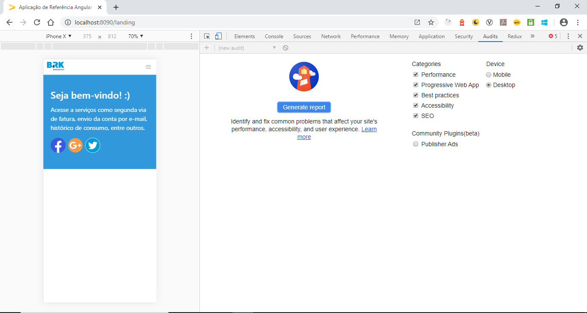
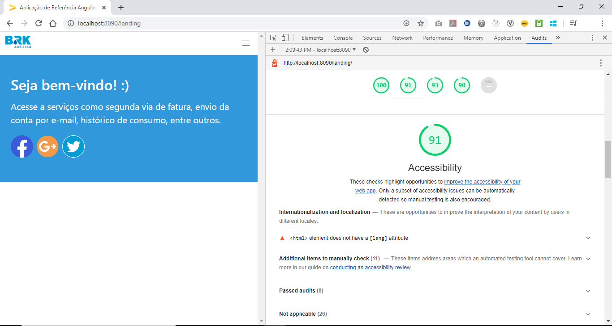

# Acessibilidade

**Acessibilidade** refere-se em tornar o conteúdo de uma aplicação disponível para qualquer pessoa, em específico o objetivo de um _Web Accessibility_ é possibilitar que usuários que apresentem algum tipo de necessidade especial sejam capazes de interagir com o sistema. Dentre as necessidades podemos listar algumas como visual, auditiva, física, fala, intelectual, de linguagem, de aprendizagem e neurológica. Desta maneira, as funcionalidades do sistema devem ser capazes de serem operadas por qualquer tipo de usuário, independente de suas condições.

Para garantir um serviço mais acessível da sua aplicação web, há um guia chamado **Web Content Accessibility Guidelines** [(WCAG)](https://www.w3.org/TR/WCAG21/) com normas e técnicas de como melhorar a qualidade deste serviço.

## Princípios de Boas Práticas

Segundo o WCAG, existem quatro princípios básicos para que seja possível alcançar maior acessibilidade dentro de uma aplicação web, cada princípio possui pelo menos uma diretriz que fornece objetivos básicos para atingir a maior acessibilidade.

| Princípio     | Descrição                                                                                                                                           |
| ------------- | --------------------------------------------------------------------------------------------------------------------------------------------------- |
| Perceptível   | As informações e componentes presentes na interface do usuário devem ser apresentadas de maneira que possam ser facilmente percebidas pelo usuário. |
| Operável      | O conteúdo dos componentes da interface e a navegação devem ser operáveis para qualquer usuário.                                                    |
| Compreensível | A informação contida na interface do usuário e sua operação devem ser facilmente compreensíveis.                                                    |
| Robusto       | O conteúdo da aplicação deve ser robusto para que possa ser interpretado de forma confiável por uma ampla variedade de agentes de usuário.          |

## Critérios de Sucesso

As diretrizes dos princípios não são testáveis. Desta maneira, são fornecidos critérios de sucesso testáveis para que seja possível utilizar as normas onde os requisitos e testes de conformidade são necessários.

Para atender todos os graus de necessidade, são definidos **três níveis**:

- **Nível A:** Nível mais baixo, no qual a página web satisfaz todos s critérios de sucesso do nível A ou é fornecido uma versão alternativa em conformidade.
- **Nível AA:** A página web deve ser capaz de satisfazer todos os critérios de sucesso do nível A e do nível AA, ou disponibilizar uma versão alternativa em conformidade com o nível AA.
- **Nível AAA:** Nível mais baixo, no qual a página web deve satisfazer todos os critérios de sucesso anteriores mais o nível AAA, ou disponibilizar uma versão alternativa em conformidade com o nível AAA.

Para maiores informações sobre critérios de sucesso e níveis das WCAG, acesse a [documentação completa](https://www.w3.org/TR/WCAG21/#conformance).

## Diretrizes

Diretrizes tem como objetivo disponibilizar uma estrutura de objetivos alcançáveis para cada princípio, auxiliando na compreensão dos critérios, aplicação de técnicas e ferramentas de verificação. Abaixo seguem suas descrições:

| Princípio        | Diretriz                     | Descrição                                                                                                            |
| ---------------- | ---------------------------- | -------------------------------------------------------------------------------------------------------------------- |
| 1. Perceptível   | 1.1 Alternativas em Texto    | Fornecer alternativas textuais para qualquer conteúdo não textual, para que possa ser transformado em outras formas. |
|                  | 1.2 Mídias com base em tempo | Fornecer alternativas para mídias baseadas em tempo.                                                                 |
|                  | 1.3 Adaptável                | Fornecer conteúdo que possa ser apresentado em diferentes maneiras sem perder suas bases.                            |
|                  | 1.4 Discernível              | Facilitar a audição e a visualização de conteúdo para os usuários.                                                   |
| 2. Operável      | 2.1 Acessível por teclado    | Toda funcionalidade deve ficar disponível a partir de um teclado.                                                    |
|                  | 2.2 Tempo suficiente         | Os usuários devem possuir tempo suficiente para ler e utilizar o conteúdo.                                           |
|                  | 2.3 Convulsões               | A aplicação não deve possuir conteúdos de uma forma conhecida por causar convulsões.                                 |
|                  | 2.4 Navegável                | A aplicação deve possuir maneiras intuitivas que auxiliem na navegação de localização de conteúdos.                  |
| 3. Compreensível | 3.1 Legível                  | O conteúdo do texto deve ser legível e compreensível.                                                                |
|                  | 3.2 Previsível               | O conteúdo deve aparecer e funcionar de modo previsível.                                                             |
|                  | 3.3 Assistência de entrada   | Ajudar os usuários a evitar e corrigir erros.                                                                        |
| 4. Robusto       | 4.1 Compatível               | Maximizar a compatibilidade entre os atuais e futuros agentes de usuário.                                            |

Para mais informações sobre diretrizes, acesse a [documentação completa](https://www.w3.org/TR/WCAG21/#compatible).

## Recomendações para o HTML

### Cabeçalhos de página

Os cabeçalhos do HTML5 auxiliam na estrutura e organização dos documentos HTML. Os cabeçalhos são formados por tags que iniciam em **\<h1>** até **\<h6>**, sendo o primeiro o de maior importância e o último de menor importância. É fundamental seguir a ordem crescente de numeração dos cabeçalhos para garantir consistência. Para mais detalhes acesse a documentação do [W3C](https://www.w3.org/TR/2014/REC-html5-20141028/sections.html#the-h1,-h2,-h3,-h4,-h5,-and-h6-elements).

### Roles Aria Landmark

**Accessible Rich Internet Applications (ARIA)** é um módulo de atributos de especificação que definem maneiras de tornar o conteúdo de uma página Web mais acessível para pessoas com necessidades especiais. Abaixo, estão as principais correspondências [ARIA](https://www.w3.org/TR/html-aria/) para as atualizações do HTML5:

| HTML 5    | Função ARIA          |
| --------- | -------------------- |
| <header>  | role="banner"        |
| <nav>     | role="navigation"    |
| <footer>  | role="contentinfo"   |
| <aside>   | role="complementary" |
| <section> | role="region"        |
| <article> | role="article"       |
| <form>    | role="form"          |

### Taxa de Constraste

A **taxa de contraste** é responsável por realizar a medição da diferença de brilho entre o primeiro plano do elemento e o seu fundo. Se a taxa de contraste for muito baixa, pode impactar na dificuldade para o usuário na distinção entre o elemento e seu fundo, por apresentarem tons de brilho muito semelhantes.

Os níveis do critério de sucesso para a taxa de contraste são definidos por:

- **Nível AA:** Pelo menos 4.5 de diferença.
- **Nível AAA:** Pelo menos 7.0 de diferença.

A visualização da taxa de contraste dos elementos da sua página são acessíveis por meio do **Color Picker** no **Chrome Dev Tools**. Para isso, aperte no quadrado do atributo **color** localizado na **aba de Styles** do seu elemento.

## Ferramentas de Verificação

### Lighthouse

O [Lighthouse](https://github.com/GoogleChrome/lighthouse) é uma ferramenta disponível para realizar análise de aplicativos e páginas web, coletando métricas de desempenho e insights sobre Performance, PWA, Acessibilidade, Boas Práticas e SEO, de acordo com as recomendações de boas práticas para desenvolvedores.

Para gerar o relatório de desempenho do Lighthouse, é necessário que sua aplicação esteja sendo executada em alguma porta url. Em seguida, na página da aplicação aperte no ícone do Lighthouse e depois no botão **Generate Report**, conforme a imagem a seguir:

