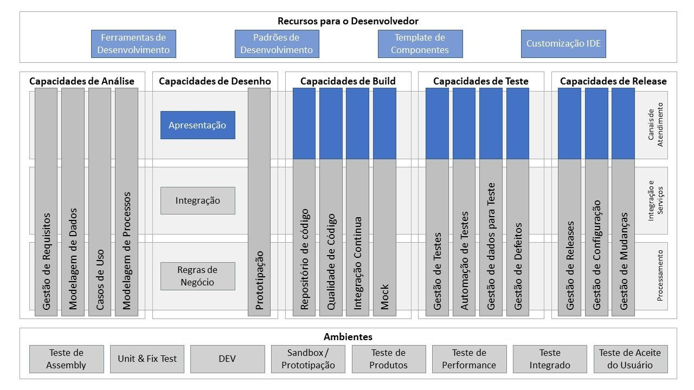
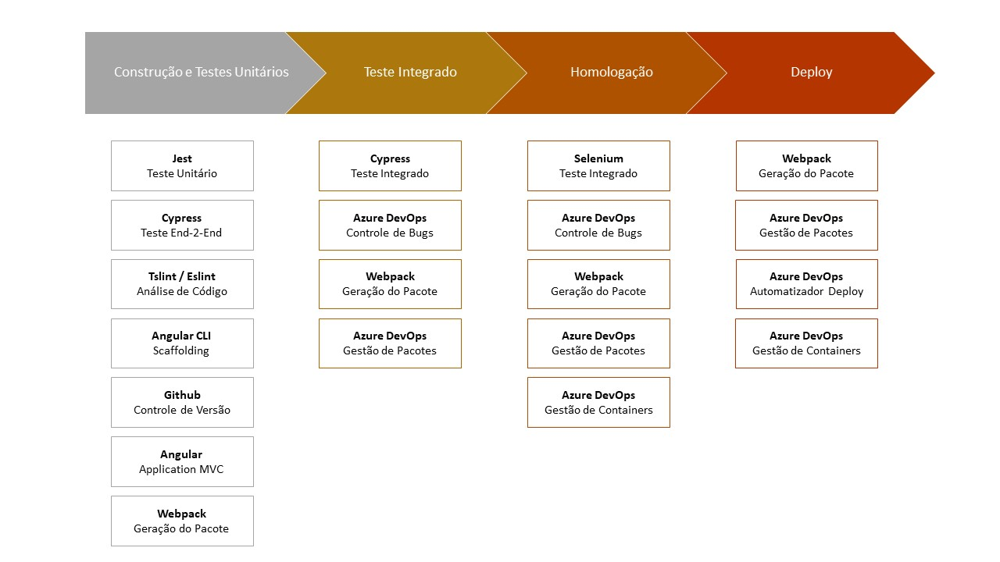

# Arquitetura de Desenvolvimento

## Visão Geral

Seção que especifica todos os padrões e aceleradores arquiteturais à serem utilizados durante o ciclo de vida de desenvolvimento de aplicações SPA Angular. Esta parte do framework detalhará por completo as capacidades, abaixo destacadas, em azul escuro e detalhará as capacidades em azul claro no que tange o âmbito SPA angular.

## Capacidades

Abaixo encontra-se detalhado a quebra das capacidades alvo desta seção, de acordo com a respectiva fase do ciclo de vida de desenvolvimento, bem como, o atalho para acesso à cada uma das capacidades.

##Construção e testes unitários

| Atalho para a Capacidade                  | Objetivo                                                                                                                  |
| ----------------------------------------- | ------------------------------------------------------------------------------------------------------------------------- |
| [Jest](./TESTES_UNITARIOS.md)             | Descrever o padrão de utilização do [Jest](https://jestjs.io/) como test runner para execução de testes unitários de SPA. |
| [Tslint](./ANALISE_ESTATICA_DE_CODIGO.md) | Descrever padrão de análise de qualidade de código adotado pela presente arquitetura.                                     |
| [Github](./VERSIONAMENTO_CODIGO.md)       | Descrever o padrão de versionamento de código SPA no Github.                                                              |
| [Angular](./CONCEITOS_ANGULAR.md)         | Descreve os componentes da arquitetura [Angular](https://angular.io/).                                                    |
