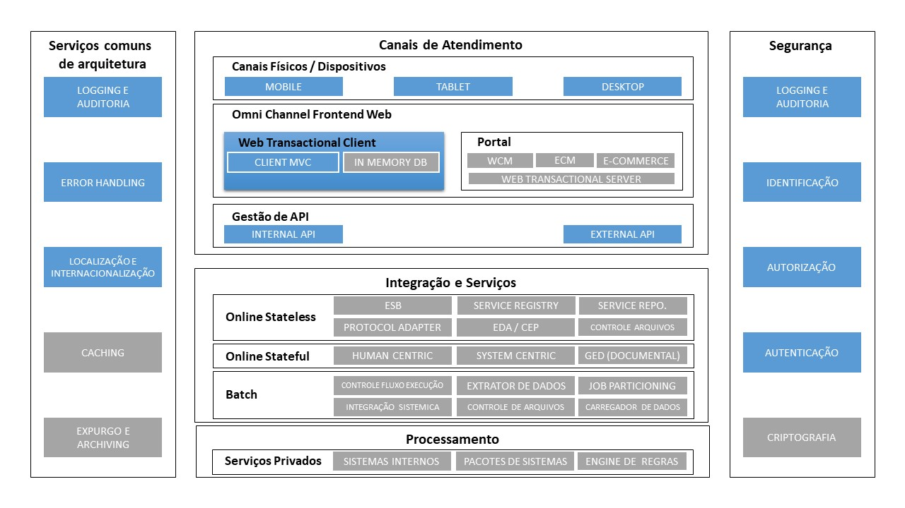
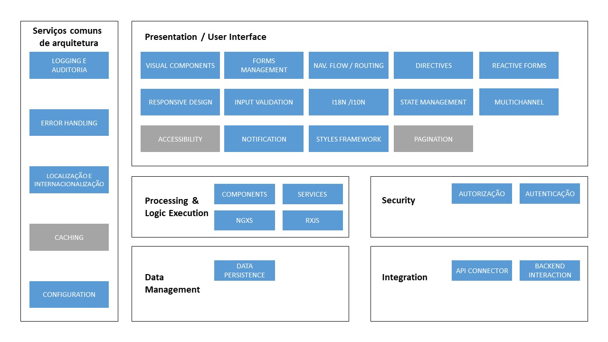

# Arquitetura de Execução

## Visão Geral

Seção que especifica todos os padrões e aceleradores arquiteturais à serem utilizados durante o ciclo de vida de desenvolvimento de aplicações Angular.

Esta parte do framework detalhará por completo as capacidades, abaixo destacadas, em azul escuro e detalhará as capacidades em azul claro no que tange o âmbito de SPA.

## Capacidades

Abaixo encontra-se detalhado a representação gráfica das camadas da arquitetura de execução, bem como, o atalho para acesso à cada uma das capacidades.

| Capacidade                                          | Artefatos de Arquitetura                                                           | Descrição                                                                                                                                                                                                                                                                                                                                                                                    |
| --------------------------------------------------- | ---------------------------------------------------------------------------------- | -------------------------------------------------------------------------------------------------------------------------------------------------------------------------------------------------------------------------------------------------------------------------------------------------------------------------------------------------------------------------------------------- |
| Componentes Visuais                                 | [Componentes](./../projects/acn/ui/src/lib/README.md)                              | Conjunto de componentes visuais customizados desenvolvidos com a identidade visual do projeto                                                                                                                                                                                                                                                                                                |
| Multi-channel                                       | [Componentes](./../projects/acn/angular/src/lib/core/multichannel/README.md)       | Conjunto de componentes que permitem ao usuário acessar a aplicação a partir de qualquer canal, independente de horário, localização ou dispositivo.                                                                                                                                                                                                                                         |
| Localização                                         | [Localization](./../projects/acn/angular/src/lib/i18n/README.md)                   | Padrão de instalação e utilização de internacionalização no projeto.                                                                                                                                                                                                                                                                                                                         |
| Notificações                                        | [Componentes](./../projects/acn/ui/src/lib/acn-notification/README.md)             | Componente de notificações para exibição de mensagens ao usuário.                                                                                                                                                                                                                                                                                                                            |
| Responsive Design                                   | [Grid](./GRID.md)                                                                  | Malha formada por um conjunto de linhas verticais e horizontais que tem como objetivo ajudar a posicionar elementos na tela por meio de containers, linhas e colunas. Como padrão de arquitetura, decidimos adotar o sistema de grid do Bulma, atualmente construído com flexbox e totalmente responsivo.                                                                                    |
| Input Validation                                    | [Validators](./../projects/acn/ui/src/lib/validators/README.md)                    | Componentes utilizados para validar dados de entrada do usuário verificando sua exatidão e integridade. Tipicamente é utilizado em formulários.                                                                                                                                                                                                                                              |  |
| Fluxo de Navegação / Roteamento                     | [Componentes](./ANGULAR_NAVEGACAO_ROTEAMENTO.md)                                   | Componente responsável pelo mapeamento de rotas, controle de acesso as rotas e controle de lazy-load dos módulos baseado nas rotas.                                                                                                                                                                                                                                                          |
| Reactive Forms                                      | [Componentes](./ANGULAR_FORMULARIOS.md)                                            | Formulário reativo contém as definições da utilização dos mesmos em uma aplicação Angular.                                                                                                                                                                                                                                                                                                   |
| Components                                          | [Componentes](./ANGULAR_ARQT_FRAMEWORK.md)                                         | Componentes contém a lógica de apresentação de uma página assim como o controle de seus eventos.                                                                                                                                                                                                                                                                                             |
| Services                                            | [Componentes](./ANGULAR_ARQT_FRAMEWORK.md)                                         | Serviço possui um propósito restrito e bem definido, como por exemplo, fazer o log da aplicação, acessar dados de um servidor remoto, configurar aplicações, entre vários outros.                                                                                                                                                                                                            |
| RxJS                                                | [Biblioteca](./PERFORMANCE_RXJS.md)                                                | A biblioteca RxJS tem o objetivo de auxiliar o desenvolvedor a criar aplicações mais reativas, ou seja, que possam receber um estímulo externo e reagir de diferentes formas. (Revisar)                                                                                                                                                                                                      |
| [Session & State Management](./STATE_MANAGEMENT.md) | [Componentes](./STATE_MANAGEMENT_NGXS.md)                                          | Capacidade responsável por gerenciar os estados das informações recebidas do servidor a partir de um mesmo cliente.                                                                                                                                                                                                                                                                          |  |
| Authentication                                      | [Componentes](./../projects/acn/angular/src/lib/security/authentication/README.md) | Serviço utilizado para autenticação de um usuário e senha em seu back-end respectivo.                                                                                                                                                                                                                                                                                                        |
| Authorization                                       | [Componentes](./../projects/acn/angular/src/lib/security/authorization/README.md)  | Componente utilizado para validar se o usuário possui acesso à determinada informação.                                                                                                                                                                                                                                                                                                       |  |
| Data Persistence                                    | [Componente](./STATE_MANAGEMENT_BROWSER_STORE.md)                                  | Componente utilizado para armazenamento local de dados.                                                                                                                                                                                                                                                                                                                                      |
| API Connector                                       | [Service](./../projects/acn/angular/src/lib/core/connector/README.md)              | Componente utilizado para comunicação do back-end.                                                                                                                                                                                                                                                                                                                                           |
| Logging                                             | [Service](./../projects/acn/angular/src/lib/core/log/README.md)                    | Logging é o componente responsável por fornecer a capacidade para a aplicação de realizar registros de log de forma centralizada (server-side).                                                                                                                                                                                                                                              |
| Configuration                                       | [Service](./../projects/acn/angular/src/lib/core/configuration/README.md)          | Configuration é a forma de realizar configuração da aplicação que podem ser separadas por ambiente (local e prod), permeando a aplicação principal e suas micro-aplicações.                                                                                                                                                                                                                  |
| Error Handling                                      | [Service](./../projects/acn/angular/src/lib/core/error-handling/README.md)         | O Error Handling é responsável por capturar error durante a execução da aplicação e realizar um tratamento padronizado de forma transparente para a aplicação. Para error de runtime o componente realiza um registro de Log referente ao erro e exibe uma notificação para o usuário, para retorno de erro de uma chamada de API o componente realiza o tratamento detalhado em sua página. |
