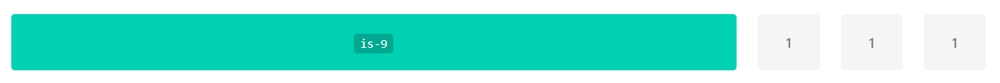
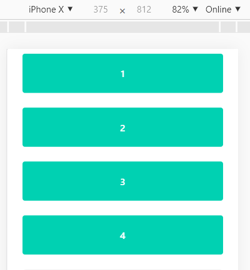
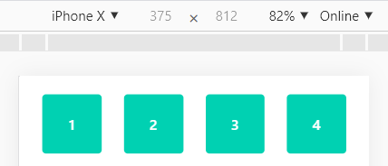

# Responsividade Grid

* [Introdução](#introdução)
* [Grid](#grid)
* [Bulma](#bulma)
* [Utilização](#utilizacao)


## Introdução

O **design responsivo** é o conceito de adaptação de uma interface a qualquer resolução de tela, adaptando a experiência de navegação/interação para mídias específicas e necessidades dos usuários.

Para colocar o conceito em prática uma das melhores técnicas é utilizar o **design responsivo fluído** onde se utiliza medidas relativas de acordo com a área de visualização e também a adequação visual dos conteúdos para garantir uma melhor experiência.

## Grid

Grid é uma malha que divide a tela ​em partes proporcionais e possibilita ​a distribuição do conteúdo de forma​ uniforme, proporcionando equilíbrio visual e estrutural. Construir um Design Responsivo se torna muito mais fácil se ele for apoiado em um Grid Flexível.

**Benefícios do Grid**
- Para o usuário
  - Facilita a leitura e o scaneamento dos elementos. ​
  - Melhora a experiência visual.​
  - Menos esforço cognitivo para interpretar o conteúdo.​
  - A distribuição proporcional dos elementos facilita a associação das informações com maior facilidade.

- Para o designer
  - Maior velocidade para desenhar elementos em tela.​
  - Padrões de espaçamento e alinhamento proporcionam uma linha de trabalho uniforme.​
  - Linguagem visual comum.
  - Mantém a consistência entre os times.

- Para o desenvolvimento
  - Padronização para que o resultado final seja o mais próximo possível do desenhado.​
  - Padrões de espaçamento e alinhamento proporcionam uma linha de trabalho uniforme.​

## Bulma

Bulma é um framework CSS totalmente gratuito, inspirado no Bootstrap e baseado em Flexbox. 

Entre suas características, estão:

- 100% responsivo (mobile first)
- Apenas CSS (não possuí JavaScript)
- Modular (importe no seu projeto somente o que você precisa)
- Moderno (construído com Flexbox)
- Livre (open Source no [GitHub](https://github.com/jgthms/bulma))

**Grid no Bulma**

O Grid no bulma possúi por padrão **12 colunas** e uma calha `gap` entre elas de **32px**.

Por ser construído com flexbox a divisão das colunas é feita automáticamente, ou seja: 
- Caso tenhamos 2 colunas, cada uma ocupará 50% do espaço.
- Caso tenhamos 3 colunas, cada uma ocupará 33,3% do espaço.
- E assim por diante...

**exemplo de 4 colunas**
```html
<div class="columns">
  <div class="column">1</div>
  <div class="column">2</div>
  <div class="column">3</div>
  <div class="column">4</div>
</div>
```


É possível também definir a porcentagem/largura para uma das colunas. Neste caso as demais irão se divir nos espaços restantes de 12 colunas.

Para isso o Bulma disponibiliza as seguintes classes:

- is-1
- is-2
- is-3
- is-4
- is-5
- is-6
- is-7
- is-8
- is-9
- is-10
- is-11
- is-12

**exemplo de definição de largura**
```html
<div class="columns">
  <div class="column is-9">is-9</div>
  <div class="column">1</div>
  <div class="column">1</div>
  <div class="column">1</div>
</div>
```



Por padrão as colunas nos dispositimos mobile serão empilhadas para proporcioar uma melhor experiência aos usuários, uma vez que o padrão de visuzalização nestes dispositivos é vertical.

```html
<div class="columns">
  <div class="column">1</div>
  <div class="column">2</div>
  <div class="column">3</div>
  <div class="column">4</div>
</div>
```


Caso queira manter o padrão de colunas nestes dispositivos basta inserir a classe respectiva `is-mobile`

```html
<div class="columns is-mobile">
  <div class="column">1</div>
  <div class="column">2</div>
  <div class="column">3</div>
  <div class="column">4</div>
</div>
```




**Breakpoints**

O Bulma tem **5** breakpoints por padrão:

- **mobile:** até 768px
- **tablet:** de 769px até 1023px
- **desktop:** de 1024px até 1215px
- **widescreen:** de 1216px até 1407px
- **fullhd:** a partir de 1408px

**Variáveis do grid**

- **\$gap:** 32px	
- **\$tablet:**	769px	
- **\$desktop:** 960px + (2 * \$gap)	
- **\$widescreen:**	1152px + (2 * \$gap)	
- **\$fullhd:**	1344px + (2 * \$gap)

## Utilização

Além das colunas para termos conteúdos responsivos com maior facilidade o **Bulma** disponibiliza um conjunto de funções `mixins` para que o desenvolvedor possa adaptar o conteúdo para cada tipo de dispositivo. 

- from(\$device)
- until(\$device)
- mobile
- tablet
- tablet-only
- touch
- desktop
- desktop-only
- until-widescreen
- widescreen
- widescreen-only
- until-fullhd
- fullhd

**exemplo de utilização**

```scss
@import "bulma/sass/utilities/_all";

:host {
  // classe default
  .login-image {
    background: url('/assets/img/login-image.svg') no-repeat;
    background-position: center left;
    background-size: contain;

    // Ajuste de responsividade apenas no tablet
    @include tablet-only {
      background-position: center;
      min-height: 350px;
      margin-bottom: 50px;
    }

    // Ajuste de responsividade apenas no mobile
    @include mobile {
      background-position: center;
      min-height: 150px;
    }
  }
}
```
