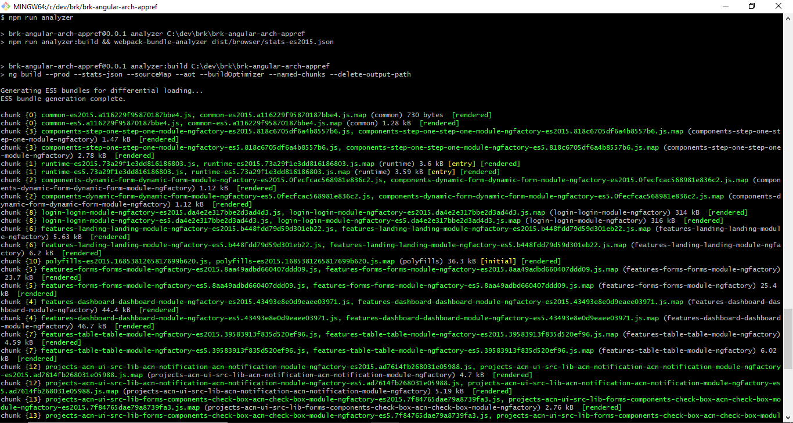
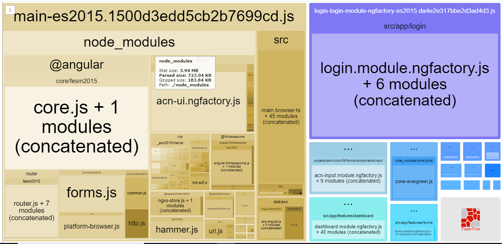
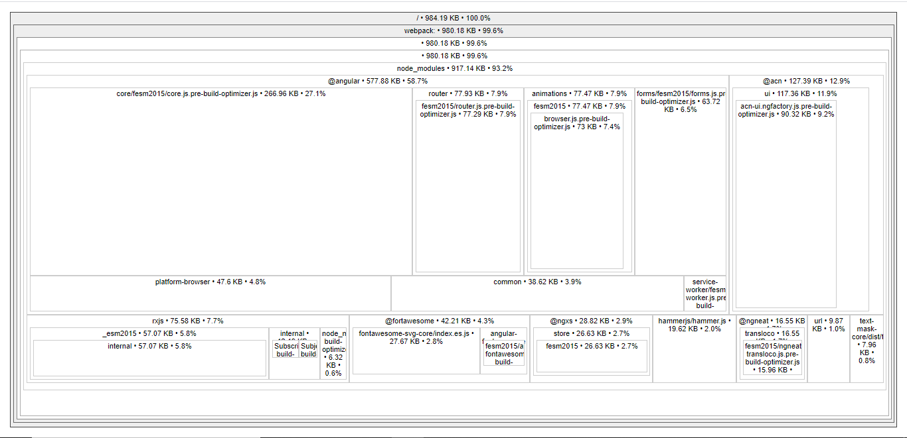

# Build da Aplicação

Nesta seção falamos sobre práticas para a otimização do tamanho do pacote da aplicação.

- [Otimizações de Build](#otimizacoes-de-build)
  - [AOT (Compilação Ahead-of-Time)](<#aot-(compilacao-ahead-of-time)>)
  - [Tree-shaking](#tree-shaking)
  - [Build-optimizer](#build-optimizer)
  - [Build de produção](#build-de-producao)
- [Otimizações do tamanho do Pacote](#otimizacoes-do-tamanho-do-pacote)
  - [Inspeção dos pacotes gerados](#inspecao-dos-pacotes-gerados)
  - [Instalação e configuração](#instalacao-e-configuracao)
  - [Execução](#execucao)
  - [Definições de Tamanho](#definicoes-de-tamanho)
  - [Atenção à pacotes de terceiros](#atencao-a-pacotes-de-terceiros)
    - [Uso desnecessário](#uso-desnecessario)
    - [Atualização de pacotes](#atualizacao-de-pacotes)

## Otimizações de Build

Uma aplicação Angular consiste principalmente em components (Typescript), assets (ex. Imagens e fontes), estilos (SASS, LESS ou CSS) e seus templates HTML. Seus componentes em específicos escritos em Typescript não podem ser entendidos diretamente pelo navegador, eles exigem um processo de transpilação antes de serem executados. O Angular oferece duas maneiras para compilar uma aplicação:

- **Just-in-Time (JIT)**, que compila a aplicação no navegador em tempo de execução.
- **Ahead-of-Time (AOT)**, que compila a aplicação no momento da criação.

A **compilação JIT** é o padrão quando você executa os comandos CLI **ng build** (somente build) ou **ng serve** (compilação e exibição local), ele facilita processo de debug no desenvolvimento.

A **compilação JIT** só deve ser utilizada em momento de desenvolvimento.

### AOT (Compilação Ahead-of-Time)

O **compilador AOT (Angular Ahead of Time)** converte o código Angular HTML e TypeScript em código JavaScript eficiente durante a fase de compilação, antes que o navegador faça o download e execute esse código. Compilar a aplicação durante o processo de build fornece uma renderização mais rápida no navegador. Temos também uma diminuição do número de requisições assíncronas e um código menor e mais seguro.

Para compilação AOT, inclua a opção **--aot** com o comando **ng build** ou **ng serve**:

```
ng build --aot
ng serve --aot
```

### Tree-shaking

Em programação é uma metáfora para eliminação de código morto, que existe no projeto mas não é utilizado na prática. O tree shaking vai percorrer o código a partir de um ou mais pontos de entrada (arquivos), e marcar os outros arquivos que vão sendo citados por import, montando uma árvore com os módulos efetivamente utilizados no código. Esse recurso já é habilitado por padrão Angular CLI.

Os imports devem ser realizados sempre mais específicos, como por exemplo **import { AcnI18nModule } from '@acn/angular/i18n'** ao invés de **import { AcnI18nModule } from '@acn/angular'**.

### Build-optimizer

Concatena os muitos arquivos de aplicativos e bibliotecas em alguns pacotes. Rescreve o código para usar nomes curtos e embaralhados de variáveis e funções. Também desabilitará a criação do chunk de vendor (pacotes de terceiros) e resultará em um código menor.

```
Flag --build-optimizer
```

### Build de produção

Ao construir uma aplicação para implantação, queremos garantir que faremos um build de produção. A flag **--prod** ativa por padrão os seguintes recursos de otimização de compilação que não estão incluídas modo desenvolvimento:

- **AOT (Compilação Ahead-of-Time)**
- **Modo de produção:** implementa o ambiente de produção com as configurações do arquivo de _environment production_.
- **Bundling:** concatena os muitos arquivos de aplicativos e bibliotecas em alguns pacotes.
- **Minificação:** remove o excesso de espaços em branco, comentários e tokens opcionais.
- **Uglification:** reescreve o código para usar nomes curtos e embaralhados de variáveis e funções.
- **Eliminação de código morto (Tree-Shaking):** remove módulos não referenciados e muito código não utilizado que resulta em um pacote final muito menor.

```
ng build --prod
ng serve --prod
```

## Otimizações do tamanho do Pacote

Aplicações Angular tendem a crescer com o desenvolvimento de novas funcionalidades e inclusão de bibliotecas, esse tamanho pode impactar na velocidade de carregamento dessas aplicações e até no ranqueamento por ferramentas de buscas (ex. Google).

### Inspeção dos pacotes gerados

Algumas ferramentas como [webpack-blunde-analyzer](https://github.com/webpack-contrib/webpack-bundle-analyzer) podem auxiliar no processo de análise onde as otimizações abaixo podem ser aplicadas:

- Identificação de imports de bibliotecas não utilizadas.
- Utilização de imports específicos artefatos ao invés de imports da biblioteca inteira.
- Utilização de Lazy-Load para módulos e bibliotecas não necessários nas telas iniciais.

### Instalação e configuração

Para a instalação do **source-map-explorer**, execute o seguinte comando:

```
npm install -D webpack-bundle-analyzer
```

Após a instalação, dentro do seu **package.json** acrescente a configuração abaixo:

```json
"scripts": {
  "analyzer": "npm run analyzer:build && webpack-bundle-analyzer dist/brk-angular-arch-appref/stats-es2015.json",
  "analyzer:build": "ng build --prod --stats-json --sourceMap --aot --buildOptimizer --named-chunks --delete-output-path",
}
```

As flags **--prod e --stats-json são obrigatórias** para execução da analise de pacote.

### Execução

Para executar a análise do pacote execute:

```
npm run analyzer
```

O comando acima irá analisar automaticamente todos os módulos, outros módulos podem ser analisados posteriormente com o comando **npx webpack-bundle-analyzer feature-forms\*.js**.

Abaixo um exemplo do relatório gerada pela aplicação de referência:





### Definições de Tamanho

O módulo **webpack-bundle-analyzer** possui três formas de exibição de valores distintos, sendo eles:

- **Stat:** Tamanho de entrada dos seus arquivos antes de qualquer transformação.
- **Parsed:** Tamanho de saída dos seus arquivo após transformações como de redução.
- **Gzipped:** Análise do tamanho dos pacotes ou módulos por meio da compactação _gzip_.

### Atenção à pacotes de terceiros

Revise os pacotes de terceiros que você está usando e veja se alternativas melhores e menores estão disponíveis, pois isso pode reduzir o tamanho final de sua compilação. Se um pacote de terceiros tem problemas de desempenho (vazamento de memória, execução dispendiosa, segurança etc.) também afetará o desempenho da aplicação. Por isso, é sempre aconselhável rever adequadamente qualquer pacote antes de usar.

#### Uso desnecessário

Incluir um pacote de terceiros apenas para obter uma pequena funcionalidade, que pode ser facilmente feita de forma nativa com JavaScript ou Angular, estará adicionando sobrecarga de tamanho desnecessária à aplicação. Por exemplo, se você está incluindo o _Lodash_ apenas para fazer uma filtragem simples de objetos, então é desnecessário, já que você pode fazer a mesma coisa nativamente em JavaScript.

#### Atualização de pacotes

Certifique-se de atualizar regularmente os pacotes de terceiros. Muitas vezes, pacotes mais novos podem conter muitas melhorias de desempenho, incluindo tamanho menor e outras otimizações de desempenho. Atualizando regularmente os pacotes, é possível obter melhorias relacionadas à correções de bugs, vulnerabilidades de segurança, de compatibilidade entre pacotes, etc.
