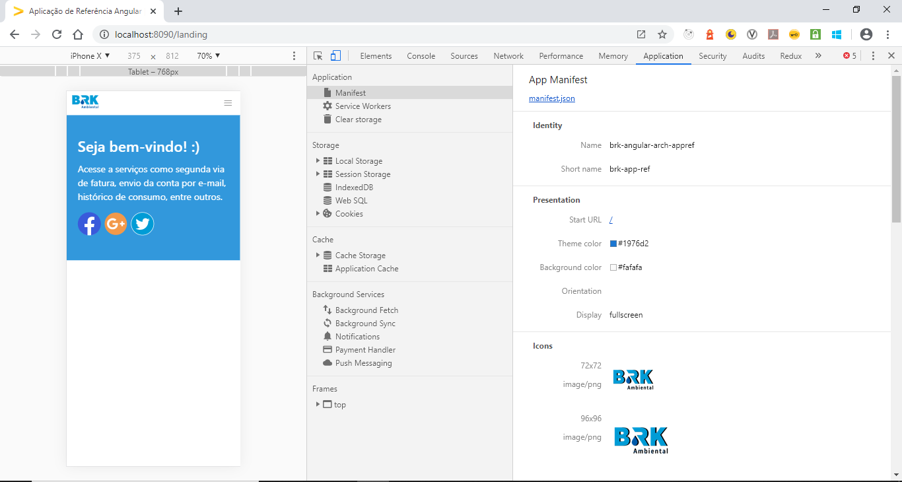

# PWA: Web App Manifest

O arquivo **Web App Manifest** possui formato JSON e é responsável por fornecer informações sobre a aplicação como nome, autor, descrição, ícones. Seu objetivo é viabilizar a instalação da aplicação web na tela home do dispositivo do usuário. Permitindo então a entrega de uma experiência melhor e mais rápida sem ter que passar por uma loja de apps, podendo fornecer acesso off-line ao conteúdo e receber notificações.

## Como utilizar?

Os arquivos manifesto devem ser colocados nas páginas HTML através de uma tag link dentro do container <head> do seu documento, conforme exemplo abaixo:

```html
<link rel="manifest" href="/manifest.json" />
```

**exemplos manifest.json**

```json
{
  "name": "brk-angular-arch-appref",
  "short_name": "brk-app-ref",
  "theme_color": "#1976d2",
  "background_color": "#fafafa",
  "display": "fullscreen",
  "scope": "/",
  "start_url": "/",
  "icons": [
    {
      "src": "assets/icons/icon-72x72.png",
      "sizes": "72x72",
      "type": "image/png"
    },
    {
      "src": "assets/icons/icon-96x96.png",
      "sizes": "96x96",
      "type": "image/png"
    },
    {
      "src": "assets/icons/icon-128x128.png",
      "sizes": "128x128",
      "type": "image/png"
    },
    {
      "src": "assets/icons/icon-144x144.png",
      "sizes": "144x144",
      "type": "image/png"
    },
    {
      "src": "assets/icons/icon-152x152.png",
      "sizes": "152x152",
      "type": "image/png"
    },
    {
      "src": "assets/icons/icon-192x192.png",
      "sizes": "192x192",
      "type": "image/png"
    },
    {
      "src": "assets/icons/icon-384x384.png",
      "sizes": "384x384",
      "type": "image/png"
    },
    {
      "src": "assets/icons/icon-512x512.png",
      "sizes": "512x512",
      "type": "image/png"
    }
  ]
}
```

Ao configurar um arquivo manifesto, você está especificando metadados básicos sobre a sua extensão, como nome e versão, e também pode especificar aspectos de suas funcionalidades, como scripts que rodam em background, scripts de conteúdo e ações do navegador. As chaves **name**, **manifest-version** e **version** são as únicas mandatórias, mas as configurações utilizadas normalmente contém essas e as propriedades **icons** e **start_url** para indicar os ícones e url de início do app respectivamente.

## Propriedades chave do Manifesto

### BACKGROUND_COLOR

Define a cor de fundo esperada pela aplicação. Esse valor repete o que é configurado nos arquivos de css, mas também é usado pelos navegadores para fazer carregar o fundo quando o manifesto fica disponível antes das folhas de estilo terem sido carregadas. Esse comportamento cria uma transição mais suave entre o carregamento da aplicação e do conteúdo.

```json
"background_color": "red"
```

Essa propriedade foi definida apenas para melhorar a experiência do usuário enquanto a aplicação é carregada, ela não deve ser utilizada pelo user agent como cor de fundo quando os arquivos css já estiverem disponíveis.

### DESCRIPTION

Fornece uma breve descrição sobre o que a aplicação faz.

```json
"description": "Aplicacao de Referencia - Arquitetura Angular"
```

### DIR

Especifica a direção do texto primário para as propriedades **name**, **short_name** e **description**. Junto com a propriedade **lang**, ajudam a definir a exibição correta de linguagens que são lidas da direita para esquerda.

```json
"dir": "rtl",
"lang": "ar",
"short_name": "أنا من التطبيق!"
```

A propriedade pode possuir os seguintes valores:

- LTR (esquerda para direita)
- RTL (direita para esquerda)
- Auto (navegador tenta adivinhar o idioma através do algoritmo bidirecional Unicode) (é valor padrão de preenchimento)

### DISPLAY

Define a preferência de modo de exibição do desenvolvedor para a aplicação.

```json
"display": "standalone"
```

| Modo de Exibição | Descrição                                                                                                                                                                                                                                                                 | Fallback Modo de Exibição |
| ---------------- | ------------------------------------------------------------------------------------------------------------------------------------------------------------------------------------------------------------------------------------------------------------------------- | ------------------------- |
| fullscreen       | Toda área de exibição disponível é utilizada e nenhum aspecto do navegador é exibido.                                                                                                                                                                                     | standalone                |
| standalone       | A aplicação web terá o look and feel de uma aplicação standalone. Isso inclui ter uma janela diferente, seu próprio ícone e launcher, etc. Nesse modo, o user agent irá excluir os controles de navegação da UI mas pode incluir outros elementos como a barra de status. | minimal-ui                |
| minimal-ui       | A aplicação web terá o look and feel de uma aplicação standalone, mas terá um conjunto mínimo de elementos de UI para controlar a navegação. O número de elementos pode variar de navegador para navegador.                                                               | browser                   |
| browser          | A aplicação é aberta no navegador em uma aba ou janela comum, variando com o navegador ou plataforma. É o modo definido padrão.                                                                                                                                           | (nenhum)                  |

### ICONS

Especifica um vetor de imagens que podem servir a aplicação em diversos contextos.

```json
"icons": [
	{
		"src": "icon/lowres.webp",
		"sizes": "48x48",
		"type": "image/webp"
	},
	{
		"src": "icon/lowres",
		"sizes": "48x48"
	},
	{
		"src": "icon/hd_hi.ico",
		"sizes": "72x72 96x96 128x128 256x256"
	},
	{
		"src": "icon/hd_hi.svg",
		"sizes": "72x72"
	}
]
```

Objetos **Image** podem conter os seguintes valores:

| Propriedade | Descrição                                                                                                                                                 |
| ----------- | --------------------------------------------------------------------------------------------------------------------------------------------------------- |
| sizes       | String contendo as dimensões da imagem separadas por espaço.                                                                                              |
| src         | Caminho para o arquivo de imagem. Se o src for uma url relativa, a url base deverá ser a url do manifesto.                                                |
| type        | Uma pista sobre o media type da imagem. O objetivo dessa propriedade é permitir ao user agent ignorar rapidamente tipos de imagem que ele não dá suporte. |

### LANG

Especifica a linguagem primária para os valores preenchidos nas propriedades **name** e **short_name**. O valor deverá ser uma string contendo a tag de linguagem única.

```json
"lang": "pt-BR"
```

### NAME / SHORT_NAME

Fornece um nome legível por humanos e que será disponibilizado para o usuário como identificador da aplicação abaixo do ícone.

```json
"name": "brk-angular-app-ref"
"short_name": "brk-app-ref"
```

### ORIENTATION

Define a orientação padrão para todas as aplicações web no topo do contexto do navegador.

```json
"orientation": "portrait-primary"
```

A orientação pode ser preenchida com qualquer uma das opções listadas abaixo:

- any
- natural
- landscape
- landscape-primary
- landscape-secondary
- portrait
- portrait-primary
- portrait-secondary

### PREFER_RELATED_APPLICATIONS

Especifica um valor booleano para permitir que o user agent sugira ao usuário utilizar alguma aplicação nativa disponível, caso o usuário deseje fazer alguma operação que a aplicação web não atenda. Caso a propriedade seja omitida, o valor padrão é falso.

```json
"prefer_related_applications": false
```

### RELATED_APPLICATIONS

Especifica um vetor de "objetos de aplicação" representando aplicações nativas que são instaláveis a partir de uma plataforma acessível pelo dispositivo (Ex. Google Play Store). Essas aplicações representam alternativa à aplicação web que oferecem funcionalidades similares ou equivalentes – uma versão nativa da aplicação web, por exemplo.

```json
"related_applications": [
	{
		"platform": "play",
		"url": "https://play.google.com/store/apps/details?id=com.example.app1",
		"id": "com.example.app1"
	}, {
		"platform": "itunes",
		"url": "https://itunes.apple.com/app/example-app1/id123456789"
	}
]
```

Os objetos de **Aplicação** podem conter as seguintes propriedades:

| Propriedade | Descrição                                                 |
| ----------- | --------------------------------------------------------- |
| plataform   | Plataforma onde a aplicação pode ser encontrada.          |
| url         | Url onde a aplicação pode ser encontrada.                 |
| id          | Id que representa a aplicação na plataforma especificada. |

### SCOPE

Define o escopo de navegação do contexto de aplicação do aplicativo web. Basicamente, restringe as páginas que podem ser acessadas enquanto o manifesto estiver sendo aplicado. Se o usuário navegar para fora do escopo, a aplicação volta a ser uma página web normal.

Se o escopo for uma url relativa, a url base será a url do manifesto.

```json
"scope": "/pwa/"
```

### START_URL

Especifica a url a ser carregada quando o usuário dispara a aplicação a partir de um dispositivo. Se for fornecida uma url relativa, a url base será a url do manifesto.

```json
"start_url": "./?utm_source=web_app_manifest"
```

### THEME_COLOR

Define o tema de cores padrão da aplicação. Isso geralmente afeta como a aplicação é exibida de acordo com o sistema operacional.

```json
"theme_color": "#3367D6"
```

## Splash screens

A partir da versão 47 do Chrome, uma **splash screen** é exibida para a aplicação disparada a partir de uma home. Essa tela é gerada automaticamente usando as propriedades definidas no manifesto, especificamente: name, background-color, e o ícone do vetor de ícones que for mais próximo à resolução de 128 dpi para o dispositivo. Os outros navegadores que rodam em Android funcionam de maneira similar ao Chrome. Atualmente para dispositivos que utilizam iOS não é possível configurar a splash screen.

## Mime Type

Manifestos deveriam ser disponibilizados utilizando o **MIME type application/manifest+json**. Essa é uma prática opcional.

## Como testar o arquivo manifest.json

Para verificar se o manifesto da sua aplicação foi configurado corretamente, acesse a guia **Manifest** no painel **Application** dentro do **Chrome DevTools**.



O DevTools ainda permite simular eventos de adicionar a tela inicial. No portal de desenvolvimento do Google há um tutorial para como testar o banner de instalação de aplicativos.

Também é possível testar de forma automatizada, através do [Lighthouse](https://developers.google.com/web/tools/lighthouse/). O Lighthouse é uma ferramenta de auditoria de aplicativos web que pode ser executada como extensão do Chrome, através de um módulo do NPM ou da aba Audits no próprio Chrome DevTools. Ao fornecer uma url ao Lighthouse, ele executa um conjunto de auditorias nessa página e mostra os resultados em um relatório. As auditorias do Lighthouse relacionadas a manifestos de aplicativos web incluem verificar se:

- O aplicativo pode ser adicionado a tela inicial
- Depois de adicionado, o aplicativo inicializa com uma tela de apresentação personalizada.
- A cor da barra de endereço do navegador foi personalizada.
- O aplicativo está em HTTPS (pré-requisito para adicionar a tela inicial).
