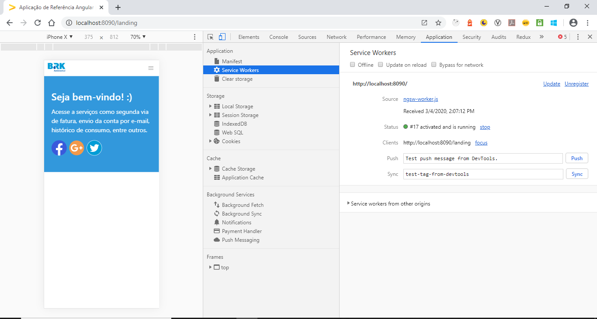

# PWA: Service Workers

**Service worker (SW)** é um proxy entre o browser e o seu backend programado em um script que o navegador roda em background. Ele possui a habilidade como interceptar, tratar e responder a requisições de rede, notificações, mudanças na conectividade e sincronização em segundo plano, possuindo controle de tráfego para carregar informações tanto da rede quanto do cache.

O service worker não possui acesso ao DOM mas pode manipular dados através das APIs [Fetch]() e [Cache](). Assim é possível armazenar em cache todos os recursos estáticos ou com pouca alteração do site, o que consequentemente reduz o número de requisições de rede e melhora a performance. Ele também pode ser utilizado para exibir o [Shell da Aplicação](./PWA_APP_SHELL.md), informando ao usuário que ele está desconectado da internet e fornecer conteúdo para interação enquanto está offline.

## Ciclo de Vida

A seguir explicaremos como funciona o ciclo de vida do Service Worker, que é totalmente orientado a eventos e não armazena estados. Seu entendimento nos permite planejar a melhor forma de atualizar e cachear os arquivos da aplicação:

1. **Register:** o Service Worker deve ser registrado no navegador para que possa reconhecer as ações do usuário. Recomenda-se atrasar o registro do Service Worker até que o evento de load tenha sido executado, para manter a renderização inicial da página mais rápida. Antes de registrar um Service Worker garante que o objeto navigator do browser possui suporte à propriedade serviceWorker. Por padrão o escopo de um Service Worker é determinado pela sua localização, por isso deve ser colocado na raiz do projeto, para ter acesso a todas as sub-pastas.
2. **Install:** evento ativado no momento de inicialização do Service Worker, ocorre somente uma vez no momento em que o navegador o registra. O navegador sempre tentará baixar o arquivo de Service Worker quando um usuário visita a aplicação. Caso haja diferenças entre o recém-baixado e o anterior, o evento install será disparado. Esse evento é tipicamente utilizado para cachear arquivos estáticos (HTML, CSS e Javascript). Alterações em arquivos estáticos não são consideradas no critério de disparo desse evento, portanto recomenda-se acrescentar sempre um comentário com data e hora da instância atual. Soluções pré-prontas como o **Workbox** e a biblioteca **@angular/service-worker** já fazem esse controle de forma automática. Caso a instalação seja bem sucedida, o Service Worker se moverá ou para o estado active ou waiting. Páginas carregando um SW pela primeira vez vão diretamente para o estado active. O SW permanecerá no estado waiting até que todas as abas que estejam sendo controladas por uma versão anterior dele tenham sido fechadas.
3. **Activate:** evento ativado após a instalação do Service Worker, também ocorre somente uma vez e quando há uma nova versão instalada sem que haja uma versão anterior rodando em outra aba. Normalmente, este evento é utilizado para deletar coisas antigas de versões anteriores.
4. **Fetch:** evento ativado toda vez que uma página for requisitada. Ele verifica se o arquivo requisitado existe no cache e caso sim, retorna o arquivo direto de lá. Caso o arquivo não exista, é possível redirecionar o usuário para alguma página (online ou offline). É o evento mais importante do SW, pois é o seu comportamento que garante que o PWA vai funcionar independentemente das condições da rede. Arquivos estáticos podem ser retornados diretamente do cache sem a necessidade da requisição à rede. Conteúdo dinâmico pode ser requisitado e cacheado, para que possa estar disponível quando o usuário estiver offline.

**Eventos avançados**

1. **Push:** evento que habilita a opção de receber notificações do servidor, mesmo que a aplicação não esteja aberta. Para receber as notificações é necessária a autorização do usuário.
2. **Sync:** evento utilizado para sincronizar conteúdos armazenados na aplicação enquanto o usuário estava offline.

## Estratégias de Cache

A seguir listaremos os casos mais comuns encontrados durante a implementação de PWAs:

### Cache de arquivos estáticos

Normalmente, todos os arquivos estáticos devem ser cacheados após o primeiro carregamento da aplicação. Isso permite a existência de um fallback no mínimo do [Shell da Aplicação](https://developers.google.com/web/fundamentals/architecture/app-shell) quando a aplicação estiver offline. Também é possível cachear recursos manualmente de acordo com a interação do usuário com a página da aplicação, como por exemplo, no caso de um botão "ler mais".

### Cache de arquivos dinâmicos

A maior parte dos dados com que as aplicações trabalham é dinâmica, e recuperada de um banco de dados através de alguma API remota. Para esse tipo de cenário existem algumas possíveis abordagens diferentes:

- **Stale-while-revalidate:** nessa estratégia o SW retorna uma versão cacheada enquanto consulta a rede para saber se há alguma versão mais atualizada. É uma boa estratégia quando o conteúdo muda pouco.
- **Cache only:** nessa estratégia o SW retorna diretamente a versão cacheada e não consulta a rede. É uma boa estratégia quando o SW está servindo conteúdo apenas para o App Shell e outros conteúdos estáticos que só são atualizados quando há uma mudança de versão na aplicação.
- **Network first, but fallback on cache:** nessa estratégia o SW verifica no servidor se há algum conteúdo novo, caso não tenha ele serve a versão cacheada. É a estratégia mais indicada para conteúdos dinâmicos na maioria dos casos.
- **Cache first, but fallback on network:** nessa estratégia o SW tenta pegar o máximo de dados possível do cache, caso não encontre o que precisa ele requisita do servidor e adiciona no cache depois. É uma estratégia mais voltada para conteúdo estático, funciona bem mas é pouco utilizada.

## Como Testar

Para verificar se o service worker da sua aplicação foi instalado e registrado corretamente, acesse a **guia Service Workers** no painel **Application** dentro do **Chrome DevTools**.

Para verificar se os arquivos foram cacheados de acordo com a estratégia implementada corretamente, acesse a **guia Cache Storage** no painel **Application** dentro do **Chrome DevTools**.

## Pontos de Atenção

- O Service Worker funciona numa thread separada no navegador, com isso não tem acesso ao DOM.
- O arquivo do Service Worker precisa sempre ter o mesmo nome e ficar sempre no mesmo lugar. Caso contrário, ficará duplicado e poderá causar conflito de dados.
- O arquivo do Service Worker não pode ser cacheado de forma alguma, caso isso aconteça, a máquina do usuário poderá ficar com cache infinito. Para evitar esse tipo de problema o ideal é sempre configurar um max-age e configurar o servidor para sempre carregar os dados novamente, sem cache.
- É importante sempre estar atento ao ciclo de vida do Service Worker, ao mesmo tempo que ele ajuda, também pode atrapalhar. O cache antigo sempre deve ser deletado quando a aplicação for atualizada.

## Referências Adicionais

- [The Offline Cookbook - Jake Archibald (inglês)](https://developers.google.com/web/fundamentals/instant-and-offline/offline-cookbook)
- [Is Service Worker Ready?](https://jakearchibald.github.io/isserviceworkerready/)
- [Caching best practices (inglês)](https://jakearchibald.com/2016/caching-best-practices/)
