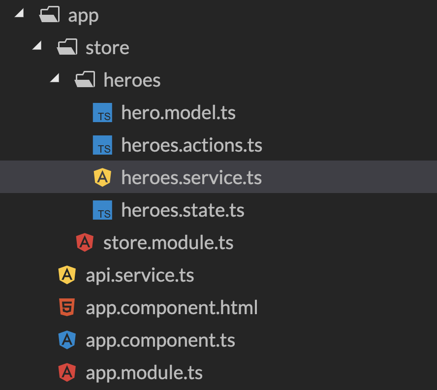
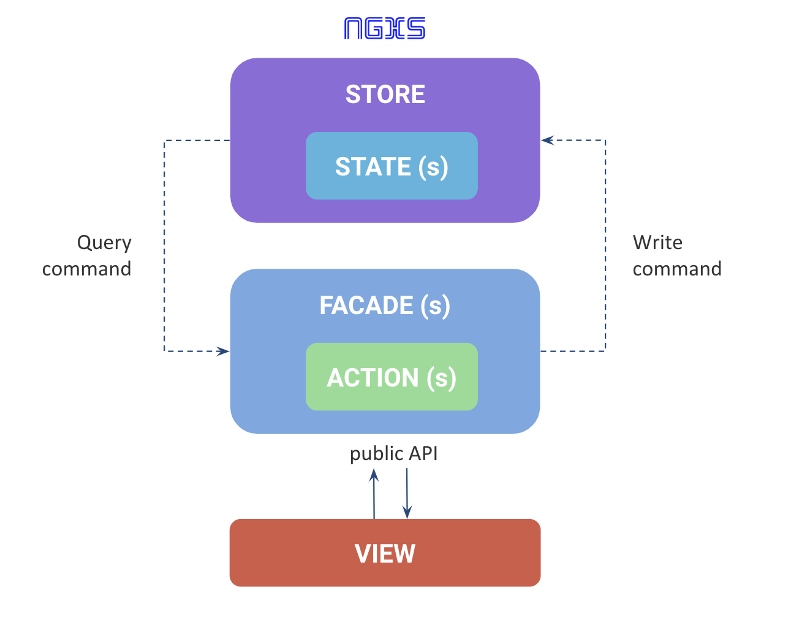

# State Management - Boas Práticas

Esta seção contempla uma lista boas práticas sugeridas ao trabalhar com gerenciamento de estados.

- [Configuração inicial](#instalação)
- [Estrutura de Projeto](#estrutura-de-projeto)

## Configuração inicial

Para utilizar o plugin na aplicação basta incluí-lo no módulo core da aplicação passando os `States` que devem ser inicializados junto com a aplicação

**store.module**

```ts
@NgModule({
  ...
  imports: [
    ...
    NgxsModule.forRoot([AppState, OutroState, ...])
  ]
})
```

### Lazy load

Caso o `State` não seja necessário logo de início da aplicação, é possível carregar tais states via lazy load.
O maior benefício desta abordagem é a economia de memória no client.

Para carregar um `State` lazy load basta incluir a chamada do `NgxsModule` no mesmo módulo da feature utilizando o método `forFeature()` neste caso.

**feature.module**

```ts
@NgModule({
  ...
  imports: [
    ...
    NgxsModule.forFeature([FeatureState])
  ]
})
```

## Estrutura de Projeto

### Crie uma pasta /store na raiz do projeto

Na raiz do projeto crie uma pasta `/store` onde serão guardados todos os arquivos dos `States`.

### Organize a pasta /store separando os States das Features por pastas

Na pasta `/store` crie pastas para agrupar os arquivos relacionados a cada feature.



### Desacoplamento entre store e compomentes (Facades)

Criando um `Service` responsável pelos disparos das actions e pelos seletores no store, conseguimos desacoplar dos componentes a responsabilidade de saber quais actions podem ser disparadas, qual a estrutura do `Store` para fazer a seleção, dentre outras possibilidades.

Com esta abordagem conseguimos também centralizar as regras de negócio para cada `State`.



**exemplo de facade - Notification.service (Facade)**

```ts
@Injectable({
  providedIn: 'root'
})
export class NotificationService {
  @Select(NotificationState)
  public notification$: Observable<IAcnNotification[]>;

  constructor(private _guid: AcnGuidService) {}

  @Dispatch()
  public add(notification: IAcnNotification) {
    const _notification = new AcnNotification({
      id: this._guid.createGuid(),
      ...notification
    });

    return new AddNotification(_notification);
  }

  @Dispatch()
  public update(notification: IAcnNotification) {
    return new AddNotification(notification);
  }

  @Dispatch()
  public remove(id: string) {
    return new RemoveNotification(id);
  }
}
```

## Plugins de desenvolvimento

### @ngxs/devtools-plugin

Para uma melhor experiência de debug do `Store` utilizamos o plugin **@ngxs/devtools-plugin** que é um conector para o plugin no Chrome [Redux DevTools](https://chrome.google.com/webstore/detail/redux-devtools/lmhkpmbekcpmknklioeibfkpmmfibljd).

Para maiores detalhes acesse a documentação [@ngxs/devtools-plugin](https://www.ngxs.io/plugins/devtools)

## Referências

- [Good Action Hygiene with NgRx - Mike Ryan](https://www.youtube.com/watch?v=JmnsEvoy-gY&feature=youtu.be).
- [NGXS Facade - Ivanov Maxim](https://medium.com/ngxs/ngxs-facade-3aa90c41497b)
- [NgRx + Facades: Better State Management - Thomas Burleson](https://medium.com/@thomasburlesonIA/ngrx-facades-better-state-management-82a04b9a1e39)
