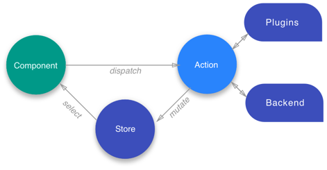

# NGXS

A biblioteca NGXS tem como função gerenciar os estados e foi feita especificamente para Angular. Ela atua como fonte central de informação para o estado da aplicação, provendo regras simples para mutações de estado previsíveis.

Sua modelagem é baseada no padrão [CQRS](https://martinfowler.com/bliki/CQRS.html) utilizado popularmente em outras bibliotecas como [Redux](https://redux.js.org/) e [NgRx](https://ngrx.io/). Uma de suas principais vantagens é a redução do código necessário para desenvolvimento pois utiliza features modernas do Typescript que permitiram sua simplificação.

Esta seção contempla uma visão geral dos conceitos chave de utilização e boas práticas:

- [Conceitos Chave](#conceitos-chave)
- [Referências](#referencias)

## Conceitos Chave

Existem 4 conceitos chave no NGXS:

- [Actions](#actions): classe que descreve a ação e a leva aos seus metadados associados.
- [State](#state): classe que define um estado.
- [Select](#select): seletor de partes de um estado.
- [Store](#store): container do estado global da aplicação, dispatcher de ações e seletores.

Em conjunto esses conceitos criam um controle de fluxo circular:



### Actions

São um conjunto de comandos que podem ter duas funções:

- **Comando**: ser gatilho para algum acontecimento;
- **Evento**: ser uma ação decorrente de algum acontecimento.

Cada ação possui um campo **type** que representa seu idenficador único, e pode possuir metadados (_constructor_).

```ts
export class AddAccount {
  static readonly type = '[Billing] Add Account';
  constructor(public name: string) {}
}
```

#### Nomenclatura

**Comando**

O nome deverá conter 3 partes:

- O contexto de onde a ação foi disparada. Exemplo: [User API], [Product Page], [Dashboard Page]
- Um verbo que descreva o que queremos fazer com a entidade.
- A entidade em que estamos executando a ação. Exemplo: User, Card, Project

Exemplos:

- [Billing API] GetAccount
- [Product Page] AddItemToCart
- [Dashboard Page] DisplayAnnouncement

**Evento**

Eventos são ações que já aconteceram e agora precisam de uma reação. As mesmas convenções para a nomenclatura de comandos se aplicam, porém os verbos utilizados devem ser conjugados no passado.

Exemplos:

- [User API] GetUserSuccess
- [Project API] ProjectUpdateFailed
- [User Details Page] PasswordChanged
- [Project Stars Component] StarsUpdated

#### Agrupamento

Para ações relacionadas ao mesmo grupo deve-se criar um **namespace** ao invés de múltiplos classe de ação no mesmo arquivo, conforme exemplo abaixo:

```ts
export namespace Billing {
  export class AddAccount {
    static readonly type = '[Billing] AddAccount';
    constructor(public payload: any) {}
  }

  export class EditAccount {
    static readonly type = '[Billing] EditAccount';
    constructor(public payload: any) {}
  }

  export class DeleteAccount {
    static readonly type = '[Billing] DeleteAccount';
    constructor(public id: number) {}
  }
}
```

### State

São classes que definem o container de um estado. Essas classes são compostas por _decorators_ que descrevem metadados e mapeiam ações. Exemplo:

```ts
import { State } from '@ngxs/store';

@State<string[]>({
  name: 'billings',
  defaults: []
})
export class BillingState {}
```

O _decorator_ de state pode ser configurado com alguns parâmetros:

- **name**: é nome da fatia do estado. É um parâmetro obrigatório e deve ser único.
- **defaults**: Conjunto de objetos / array definidos para essa fatia de estado.
- **children**: Sub-estados filhos associados.

Estados também podem possuir injeção de dependência:

```ts
@State<PaymentStateModel>({
  name: 'payment',
  defaults: {
    isAllowed: false
  }
})
export class PaymentState {
  constructor(private paymentService: PaymentService) {}
}
```

#### Definindo ações para um estado

##### Action simples

```ts
import { State, Action, StateContext } from '@ngxs/store';

export class AllowPayment {
  static readonly type = '[Payment] AllowPayment';
}

export interface PaymentStateModel {
  isAllowed: boolean;
}

@State<PaymentStateModel>({
  name: 'payment',
  defaults: {
    isAllowed: false
  }
})
export class PaymentState {
  @Action(AllowPayment)
  allowPayment(ctx: StateContext<PaymentStateModel>) {
    const state = ctx.getState();
    ctx.setState({
      ...state,
      isAllowed: !state.isAllowed
    });
  }
}
```

Para definir uma ação para um estado utilizamos o _decorator_ **@Action** passando como parâmetro uma action class ou um array com várias action classes. No exemplo acima, definimos um estado que vai escutar a ação que **AllowPayment** para saber se o usuário autorizou o pagamento. A função **allowPayment** possui um argumento do tipo **StateContext<PaymentStateModel>** que representa o contexto do estado. O contexto do estado possui um ponteiro para uma fatia e uma função exposta para definir um estado. O método **getState** sempre irá retornar a última fatia de estado atualizada na _Store_ global cada vez que for chamado. Isso garante que métodos assíncronos estejam sempre acessando o último estado. Para capturar um _snapshot_, basta clonar o estado retornado na chamada do método.

##### Action com payload

É possível passar metadados associados a uma ação específica:

```ts
import { State, Action, StateContext } from '@ngxs/store';

// Interface parte do modelo de domínio
export interface PaymentInfoModel {
  type: string;
  value: number;
  times: number;
}

export class ProcessPayment {
  static readonly type = '[Payment] ProcessPayment';
  constructor(public paymentData: PaymentInfoModel) {}
}

export interface PaymentStateModel {
  paymentInfo: PaymentInfoModel[];
}

@State<PaymentStateModel>({
  name: 'payment',
  defaults: {
    paymentInfo: []
  }
})
export class PaymentState {
  @Action(AllowPayment)
  allowPayment(ctx: StateContext<PaymentStateModel>, action: PaymentInfoModel) {
    const state = ctx.getState();
    ctx.setState({
      ...state,
      paymentInfo: [...state.paymentInfo, action.processPayment]
    });
  }
}
```

E também apenas atualizar dados específicos através da chamada do método **patchState**, e assim reduzimos a quantidade de código escrito:

```ts
  @Action(AllowPayment)
  allowPayment(ctx: StateContext<PaymentStateModel>, action: PaymentInfoModel) {
    const state = ctx.getState();
    ctx.patchState({
      paymentInfo: [
        ...state.paymentInfo,
        action.processPayment
      ]
    });
  }
```

##### Outras formas

Para saber sobre [ações assíncronas](https://www.ngxs.io/concepts/state#async-actions) e como trabalhar com [ações encadeadas](https://www.ngxs.io/concepts/state#dispatching-actions-from-actions), acesse a documentação oficial.

### Select

Selects são funções que retornam uma porção específica de um estado a partir do container de estado global.

#### Comandos e Consultas

Assim como nos padrões CQRS e Redux, a ideia é usar **comandos** (write) para atualizar dados e **consultas** (read) para ler dados.

- Os comandos devem ser baseados em tarefas, em vez de centrados nos dados.
- Os comandos podem ser colocados em uma fila para processamento assíncrono, em vez de serem processados de forma síncrona.
- As consultas nunca modificam os dados. Uma consulta retorna um DTO que não encapsula qualquer conhecimento de domínio.

Para ler os dados da Store, utilizamos o operador **select** para obter essa informação.

No NGXS, existem duas formas de utilizar esse operador:

##### Chamar o método **select** no service da Store

```ts
import { Store } from '@ngxs/store';

@Component({ ... })
export class BillingComponent {
  installments$: Observable<string[]>;

  constructor(private store: Store) {
    this.installments$ = this.store.select(state => state.billing.installments);
  }
}
```

##### Utilizar o _decorator_ **@Select**

```ts
import { Select } from '@ngxs/store';
import { BillingState, BillingStateModel } from './billing.state';

@Component({ ... })
export class BillingComponent {
  // Lê o nome do estado a partir da classe de estado
  @Select(BillingState) billing$: Observable<string[]>;

  // Utiliza o seletor armazenado e apenas retorna ele
  @Select(BillingState.installments) installments$: Observable<string[]>;

  // Também aceita função como parâmetro de entrada
  @Select(state => state.billing.installments) installments$: Observable<string[]>;

  // Lê o nome do estado a partir do parâmetro
  @Select() billing$: Observable<BillingStateModel>;
}
```

#### Select Snapshot

A função **selectSnapshot** permite capturar o valor puro do estado, é útil para casos em que não se pode utilizar Observables.

```ts
@Injectable()
export class AuthInterceptor implements HttpInterceptor {
  constructor(private store: Store) {}

  intercept(
    req: HttpRequest<any>,
    next: HttpHandler
  ): Observable<HttpEvent<any>> {
    const token = this.store.selectSnapshot<string>(
      (state: AppState) => state.auth.token
    );
    req = req.clone({
      setHeaders: {
        Authorization: `Bearer ${token}`
      }
    });

    return next.handle(req);
  }
}
```

#### Select com Memória

Frequentemente os mesmos seletores poderão ser utilizados em vários lugares difentes ou haverá aqueles seletores que serão tão complexos que precisarão ficar em um arquivo à parte do componente. O _decorator_ **@Selector** permite que isso seja possível, pois para aumentar a performance da aplicação ele memoriza a função de seleção assim como a porção do estado que está sendo trabalhada pelo componente. Exemplo:

**State Class**

```ts
import { State, Selector } from '@ngxs/store';

@State<string[]>({
  name: 'billing',
  defaults: []
})
export class BillingState {
  @Selector()
  static installments(state: string[]) {
    return state.filter(s => s.indexOf('installments') > -1);
  }
}
```

**App Component**

```ts
@Component({...})
export class AppComponent {
  @Select(BillingState.installments) installments$: Observable<string[]>;
}
```

Para opções de configuração e outros tipos de seletores, acesse a [documentação oficial](https://www.ngxs.io/concepts/select#selector-options).

### Store

A store é o gerenciador global de estados. Ela é responsável por executar ações que os containers de estado escutam e de prover uma forma de capturar pequenos blocos de dados do estado global.

#### Execução de actions

Para executar ações, é preciso injetar a _Store_ dentro do _componente_ / _service_ e invocar o método **dispatch** passando como parâmetro uma Action ou um array de Actions que deverão ser disparadas.

**exemplo de uma action**

```ts
import { Store } from '@ngxs/store';
import { AddAccount } from './billing.actions';

@Component({ ... })
export class PaymentComponent {
  constructor(private store: Store) {}

  addAccount(name: string) {
    this.store.dispatch(new AddAccount(name));
  }
}
```

**exemplo de array de actions**

```ts
this.store.dispatch([new AddAccount('Jose'), new AddAccount('Maria')]);
```

#### Capturando uma parte do state

Também é possível adicionar callbacks para serem executados após a conclusão de uma determinada action, pois método _dispatch_ retorna um Observable. No entanto, é preciso identificar o estado que chamou aquela action de alguma forma uma vez que o Observable retornado é do tipo _void_. Então, para capturar o estado da aplicação após a execução daquelas actions, utilizaremos um **@Select** na cadeia:

```ts
import { Store, Select } from '@ngxs/store';
import { Observable } from 'rxjs';
import { withLatestFrom } from 'rxjs/operators';
import { AddAccount } from './billing.actions';

@Component({ ... })
export class PaymentComponent {

  @Select(state => state.billings) billings$: Observable<any>;

  constructor(private store: Store) {}

  addAccount(name: string) {
    this.store
      .dispatch(new AddAccount(name))
      .pipe(withLatestFrom(this.billings$))
      .subscribe(([_, billings]) => {
        // do something with billings
        this.form.reset();
      });
  }

}
```

##### Snapshot

Para captura um snapshot do estado podemos utilizar o método **store.snapshot()**. Ele irá retornar o valor inteiro da store para aquele ponto no tempo.

#### Reset da Store

O método **store.reset(objState)** permite resetar totalmente o estado passado como argumento sem disparar nenhuma actions ou evento do ciclo de vida.

## Referências

- (Documentação oficial) [https://www.ngxs.io]
- (Code Cartoon - Pattern Redux) [https://code-cartoons.com/a-cartoon-intro-to-redux-3afb775501a6]
