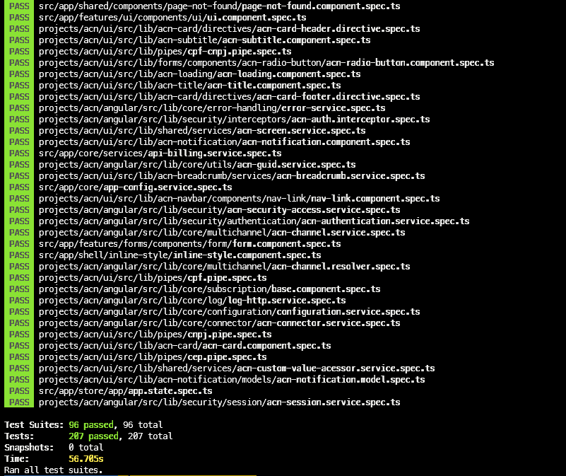
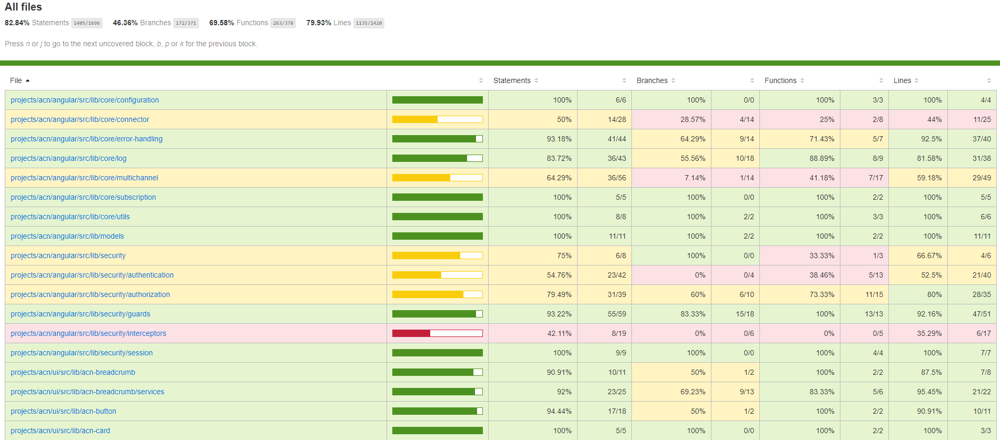

# Testes Unitários

- [Introdução](#introducao)
- [Ferramentas de Teste](#ferramentas-de-teste)
- [Instalação e Configuração](#instalação-e-configuração)
- [Execução dos Testes Unitários](#execução-dos-testes-unitários)
- [Jest: Visão Geral](#jest-visão-geral)
  - [Configuração](#configuração)
  - [Principais Conceitos](#principais-conceitos)
  - [Setup e Finalização dos Testes](#setup-e-finalização-dos-testes)
  - [Como desativar suites e specs](#como-desativar-suites-e-specs)
  - [Como ativar suites e specs](#como-ativar-suites-e-specs)
  - [Mocks](#mocks)
  - [Padronização de escrita dos testes](#padronização-de-escrita-dos-testes)
- [TestBed: Visão Geral](#testbed-visão-geral)
- [Boas Práticas para escrita de testes unitários](#boas-práticas-para-escrita-de-testes-unitários)
- [Exemplos](#exemplos)
- [Referências](#referências)

## Introdução

O teste unitário é uma maneira para conferir a corretude do código, analisando suas menores partes, de diferentes componentes e métodos. Os testes devem ser realizados em cada um dos métodos e validar se o retorno dos artefatos contém a resposta desejada. Caso o componente dependa de chamadas a outros componentes ou serviços, é preciso simular estas requisições através de mocks, evitando o uso de um teste integrado. Ao analisar o código dessa forma, é possível verificar qual regra de negócio pode estar causando problemas e não comprometer o código principal, simulando seu comportamento em cenários distintos, garantindo que quando for inserido numa aplicação real, ele se comportará da maneira desejada.

## Ferramentas de Teste

| Framework | Descrição                                                                                                                                           |
| --------- | --------------------------------------------------------------------------------------------------------------------------------------------------- |
| Jest      | O Jest é um módulo que permite executar testes e debug do código no navegador de modo mais otimizado, provendo também métodos para mock de funções. |

## Instalação e Configuração

### Instalação dos Pacotes

Ao criar um projeto utilizando o Angular CLI, é necessário fazer a instalação do Jest. Para isso, basta executar o seguinte comando:

```json
npm install -D jest ts-jest @types/jest
```

### Configuração

O Angular CLI não configura o Jest para a realização de testes unitários. Desta maneira, é necessário realizar a seguinte configuração é necessária dentro do arquivo **package.json**:

```ts
...
  "scripts": {
	...
    "test": "jest",
    "test:coverage": "jest --runInBand --coverage",
    "test:snapshot": "jest --coverage -u",
    "test:watch": "jest --clearCache && jest --watch",
    "test:clear": "jest --clearCache",
	...
  },
...
```

Também será necessário criar um arquivo chamado **jest.config.js** e preencher conforme o seguinte modelo:

```js
module.exports = {
  collectCoverageFrom: [
    'src/{**/**,**}/*.ts',
    '!src/*.ts',
    '!**/index.ts',
    '!src/{**/**,**}/*.{module,interface,model,resolver,dto}.ts',
    '!src/environments/**',
  ],
  testPathIgnorePatterns: ['/node_modules/', '/dist/', '/projects/', '/e2e/', '/universal/'],
  preset: 'jest-preset-angular',
  setupFilesAfterEnv: ['<rootDir>/jest-setup.ts'],
  transformIgnorePatterns: ['node_modules/(?!@ngrx)'],
  moduleFileExtensions: ['js', 'json', 'ts', 'tsx'],
  testResultsProcessor: 'jest-sonar-reporter',
  modulePathIgnorePatterns: ['<rootDir>/dist/'],
  globals: {
    'ts-jest': {
      tsConfig: 'src/tsconfig.spec.json',
      stringifyContentPathRegex: '\\.html?$',
    },
  },
};
```

A implementação dos testes unitários são realizados nos arquivos **.spec** de cada módulo.

## Execução dos Testes Unitários

Para execução dos testes, é necessário executar o seguinte comando:

```json
npm test
```

Após a execução do comando, o Jest irá abrir o browser na linha de comando e executará os testes, mostrando o resultado de cada um, conforme abaixo:



Para gerar o relatório de cobertura de testes unitários, execute o seguinte comando:

```json
npm run test:coverage
```

O comando acima gera uma pasta coverage na raiz da aplicação, com o resultado de cobertura de testes em formato HTML e LCOV (suportado pelo SonarQube).



Para consultar a lista de parâmetros possíveis para o comando **ng test**, visite a [documentação oficial](https://github.com/angular/angular-cli/wiki/test).

### Testes em projetos com Bibliotecas

Em projetos que possuem bibliotecas (como em micro-aplicações), deve ser informado o nome do projeto ao executar os testes, através da flag _--project_:

```json
npm run test:lib
```

Para saber os nomes dos projetos, consulte o arquivo **angular.json** na pasta raiz da aplicação.

## Jest: Visão Geral

### Configuração

A configuração do Jest pode ser definida no arquivo package.json do seu projeto, ou através de um arquivo de jest.config.js ou através do --config <path/to/js|json>. A configuração completa do Jest está disponível no seguinte [link](https://jestjs.io/docs/en/configuration).

| Propriedade                          | Descrição                                                                                                                                                |
| ------------------------------------ | -------------------------------------------------------------------------------------------------------------------------------------------------------- |
| automock [boolean]                   | Todos os módulos importados dentro dos testes devem ser reproduzidos automaticamente.                                                                    |
| bail [boolean]                       | Faz com que o Jest pare de rodar os testes depois da primeira falha.                                                                                     |
| browser [boolean]                    | Campo referente ao Browserify no package.json.                                                                                                           |
| cacheDirectory [string]              | Opção em que você pode personalizar o diretório em que o Jest armazena informações de cache em disco. O padrão é "/tmp/<path>".                          |
| collectCoverage [boolean]            | Esta opção define se a informação de cobertura deve ser coletada enquanto o teste está sendo executado.                                                  |
| coverageReporters [array]            | Lista de reports que o Jest utiliza para escrever os testes de cobertura.                                                                                |
| notify [boolean]                     | Ativa notificações para os resultados do teste.                                                                                                          |
| preset [string]                      | É a base da configuração Jest. O preset aponta para um módulo npm que exporta um **jest-preset.json** ou **jest-preset.js** de um nível superior.        |
| projects [array]                     | O Jest executa testes em todos os projetos que foram passados dentro do array ao mesmo tempo.                                                            |
| reporters [array]                    | Adiciona reporters personalizados ao Jest. Reporters são classes que implementam métodos _onRunStart_, _onTestStart_, _onTestResult_, _OnRunComplete_.   |
| resetMocks [boolean]                 | Reseta automaticamente o estado dos mocks entre cada teste.                                                                                              |
| resetModules [boolean]               | O registro do módulo de cada arquivo de teste é resetado antes de executar cada teste individualmente.                                                   |
| roots [array]                        | Lista de caminhos para diretórios que o Jest deve utilizar para pesquisar por arquivos.                                                                  |
| setupTestFrameworkScriptFile[string] | Definição do caminho para um módulo que execute algum código para configurar o framework de testes antes de cada teste.                                  |
| testEnvironment [string]             | Ambiente de teste que será utilizado para a geração dos testes. Por padrão, o Jest é um ambiente semelhante com um navegador através do _jsdom_.         |
| testMatch [array]                    | Padrões glob que o Jest usa para detectar arquivos de teste.                                                                                             |
| testPathIgnorePatterns [array]       | Quando este array de padrões de strings de regexp é enviado, o Jest faz uma comparação nos caminhos e ignora aquele que coincidir com algum dos padrões. |
| testRunner [string]                  | Executor de testes personalizado. O padrão utilizado é o jasmine2.                                                                                       |
| timers [string]                      | Se for colocado como fake, usa um temporizador falso. Útil para quando uma parte do código demanda muito tempo de execução.                              |
| verbose [boolean]                    | Se for ativado, mostrará todos os erros de cada teste individual na parte inferior após a execução.                                                      |

### Principais Conceitos

- **Suites:** Função **describe( "string", function)**, recebe um título e uma função contendo uma ou mais _specs_ de um cenário de testes.
- **Specs:** Função **it("string", function)** ou test("string", function), recebe um título e uma função de uma ou mais _Expectations_. Cada função **it()** executa um teste específico.
- **Expectations:** Função **expect()** que recebe um valor que deve ser avaliado como verdadeiro ou falso, retornando o resultado de cada execução de cada spec. A lista completa de **expect()** pode ser encontrada no seguinte [link](https://jestjs.io/docs/en/expect).
- **Matchers:** São helpers pré-definidos para testes mais comuns, que retornam uma comparação booleana entre um valor real e o valor esperado (que está sendo testado), como por exemplo **.toBe(valorEsperado)**. A lista completa dos métodos pode ser verificada nos seguinte [link](https://jestjs.io/docs/en/using-matchers).

É importante executar os testes e mocks dentro de cada _spec_, desta forma, é possível lidar com cada teste isoladamente.

### Setup e Finalização dos Testes

No Jest, existem 4 métodos para preparar os teste e tratar o código após seu término, evitando qualquer duplicidade:

- **beforeEach():** Executa alguma configuração antes de cada uma das _specs_.
- **afterEach():** Executa algum tratamento após cada uma das _specs_.
- **beforeAll():** Executa alguma configuração antes de cada uma das _suites_.
- **afterAll():** Executa algum tratamento após cada uma das _suites_.

### Como desativar suites e specs

Com as funções **xdescribe("string", function)** e **xit("string", function)** é possível temporariamente desativar aquela _suite_ ou _spec_ em específico. Desta maneira, o teste rodará normalmente e irá pular os _describes_ e _its_ que tiverem o **"x"** na frente.

```js
it('can load instance', () => {
  expect(comp).toBeTruthy();
});

xit('rota defaults to: undefined', () => {
  expect(comp.rota).toEqual(undefined);
});
```

### Como ativar suites e specs

Com as funções **fdescribe("string", function)** e **fit("string", function)** é possível temporariamente ativar aquela _suite_ ou _spec_ em específico. Desta maneira, o teste rodará normalmente e vai realizar o processo inverso de um **xdescribe ou xit**, ou seja, irá executar somente os **describes e its** que tiverem o **"f"** declarado na frente.

```js
fit('can load instance', () => {
  expect(comp).toBeTruthy();
});

it('rota defaults to: undefined', () => {
  expect(comp.rota).toEqual(undefined);
});
```

### Mocks

Por meio dos mocks, é possível verificar o comportamento de uma função que é chamada dentro de outro código, sem chamá-la de fato, apenas substituindo-a por um espião para testar apenas o seu retorno. Dentro do Jest, utilizamos essa chamada por meio do método [mock()](https://jestjs.io/docs/en/mock-function-api) com a função [jest.fn()](https://jestjs.io/docs/en/jest-object). Um exemplo desta aplicação é dentro do CadastroComponent, no qual é necessário mockar a chamada ao _ClienteService_ e a \*ActivateRoute por meio da função **jest.fn()** e **mockReturnValue()** para mascarar estas chamadas:

```js
    beforeEach(() => {
        routerStub = {navigate: jest.fn()};
        clientesServiceStub = {getListaEstadoCivil: jest.fn(), get: jest.fn(), salvar: jest.fn() };
        clientesServiceStub.getListaEstadoCivil.mockReturnValue(of([{ id: 1, nome: 'Solteiro' }, { id: 2, nome: 'Casado' }]));

        ...
    })
```

Em caso de chamadas de APIs, é recomendável mockar estas chamadas.

### Padronização de escrita dos testes

Segue abaixo o modelo de padronização na escrita de teste unitários sugerido:

- **Describe Principal:** Este tipo de describe em específico é a primeira declaração que descreve no seu código o artefato que será testado, reunindo todos os blocos do teste, sendo eles describe, **it**, **beforeEach**, **beforeAll**, **afterEach** e **afterAll**. O nome deverá conter o nome da classe sem pontos
- **Describe:** Cada método do artefato será organizado por um describe, dentro deste serão testadas as condições e respostas esperadas deste método. A nomenclatura deverá ser seguindo o nome do método.
- **It:** São as condições de execução e respostas esperadas do método **(describe)**. Cada condição deverá ser **separada por its**, e o nome será a condição que deve executar.

Exemplo:

```js
import { ClientesService } from './clientes.service';
import { ClienteModel, EstadoCivilModel } from './models';
import { of } from 'rxjs';

describe('ClientesService', () => {
  let clientesService: ClientesService, httpClientSpy, mockConfig;

  beforeEach(() => {
    httpClientSpy = { get: jest.fn(), put: jest.fn(), post: jest.fn(), delete: jest.fn() };
    mockConfig = { api: 'example' };
    clientesService = new ClientesService(httpClientSpy, mockConfig);
  });

  describe('Salvar', () => {
    it('Sem id', () => {
      const cliente: ClienteModel = {
        id: undefined,
        nome: 'Ana',
        email: 'ana@example.com',
        estadoCivil: 'solteira',
        sexo: 'feminino',
        dataNascimento: new Date(1998, 6, 3),
        cpf: '33366699911',
      };

      httpClientSpy.post.mockReturnValue(of(true));
      clientesService.salvar(cliente);
      expect(httpClientSpy.post).toHaveBeenCalledWith(mockConfig.api + '/cliente', cliente);
    });

    it('Com id', () => {
      const cliente: ClienteModel = {
        id: 333666,
        nome: 'Igor',
        email: 'igor@example.com',
        estadoCivil: 'solteiro',
        sexo: 'masculino',
        dataNascimento: new Date(1998, 6, 2),
        cpf: '12366699911',
      };

      httpClientSpy.put.mockReturnValue(of(true));
      clientesService.salvar(cliente);
      expect(httpClientSpy.put).toHaveBeenCalledWith(
        mockConfig.api + '/cliente/' + cliente.id,
        cliente,
      );
    });
  });

  describe('Remover', () => {
    it('Cliente pelo Id', () => {
      httpClientSpy.delete.mockReturnValue(of(true));

      clientesService.excluir(3).subscribe(() => {
        expect(httpClientSpy.delete).toHaveBeenCalledWith(mockConfig.api + '/clientes/' + 3);
      });
    });
  });
});
```

## TestBed: Visão Geral

[TestBed](https://angular.io/api/core/testing/TestBed) é um componente da arquitetura angular que cria um ambiente isolado para seus testes provendo métodos para criar componentes, acessar elementos do HTML e simular o ciclo de vida do mesmo sendo utilizado para testes integrados e testes unitários de [Componente](./TESTES_UNITARIOS_COMPONENTES.md) e [Diretiva](./TESTES_UNITARIOS_DIRETIVAS.md).

Evitar o uso de TestBed para serviços, pipes e validator simplificando assim esses testes

## Boas Práticas para escrita de testes unitários

As seguintes práticas devem ser seguidas durante a criação de testes unitários, pois ajudam a melhorar a compressão e manutenabilidade do código.

- Utilizar textos claros e objetivos nas instruções _describe_ e _it_;
- Centralizar códigos reutilizáveis em vários testes dentro de funções privadas;
- Utilizar blocos de _beforeEach_ e _afterEach_ para centralizar funções comuns a todos os testes;
- Utilizar blocos describe aninhados;
- Criar testes para reproduzir cada bug encontrado;

## Exemplos

- [Testes de Componentes](./TESTES_UNITARIOS_COMPONENTES.md)
- [Testes de Serviços](./TESTES_UNITARIOS_SERVICOS.md)
- [Testes de Diretivas](./TESTES_UNITARIOS_DIRETIVAS.md)
- [Testes de Pipes](./TESTES_UNITARIOS_PIPES.md)

## Referências

- [Documentação Oficial - Guia de Testes Angular](https://angular.io/guide/testing)
